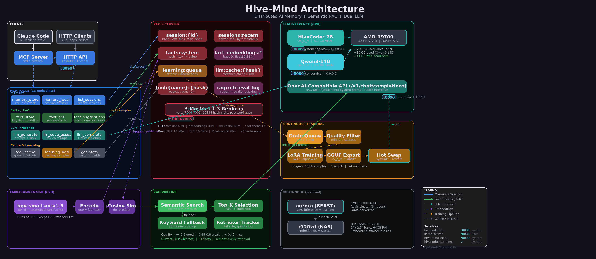

# Hive-Mind

> **Distributed AI Memory System with Semantic RAG, Continuous Learning, and Dual LLM Inference**

[](VERSION)
[](https://redis.io/)
[](https://www.python.org/)
[](https://rocm.docs.amd.com/)
[](https://pytorch.org/)
[](LICENSE)

A self-improving AI memory system that persists context across sessions, enriches LLM prompts with semantic RAG, and continuously fine-tunes a local model from its own interactions. Fully local, zero cloud dependencies.



---

## What It Does

- **Persistent memory** across terminal restarts, shared across machines via Redis cluster
- **Semantic RAG** that automatically injects relevant context into every LLM prompt
- **Continuous learning** pipeline that collects interactions, fine-tunes via LoRA, exports to GGUF, and hot-swaps the model into production
- **Dual LLM serving** on a single GPU (HiveCoder-7B specialist + Qwen3-14B general purpose)
- **Dual access modes** via MCP protocol (Claude Code) and HTTP API (any client)
- **Active retrieval tracking** with hit rate monitoring and gap analysis

---

## Architecture

| Component | Port | Role |
|-----------|------|------|
| **Redis Cluster** | 7000-7005 | 3 masters + 3 replicas, sessions, facts, caches, streams |
| **HiveCoder-7B** | 8089 | Fine-tuned Qwen2.5-Coder-7B (LoRA), system service |
| **Qwen3-14B** | 8080 | General-purpose thinking model, user service |
| **HTTP API** | 8090 | FastAPI server, OpenAI-compatible proxy with RAG injection |
| **MCP Server** | stdio | Claude Code integration, 13 tools |
| **Learning Daemon** | - | 5-min interval, drains queue, triggers training |

### MCP Tools

| Category | Tools |
|----------|-------|
| **Memory** | `memory_store`, `memory_recall`, `memory_list_sessions` |
| **Facts / RAG** | `fact_store`, `fact_get`, `fact_delete`, `fact_suggestions` |
| **LLM** | `llm_generate`, `llm_code_assist`, `llm_complete` |
| **System** | `tool_cache_get`, `tool_cache_set`, `learning_queue_add`, `get_stats` |

### Data Flow

```
User Query
  -> MCP Server or HTTP API
    -> Semantic RAG (embed query, cosine sim against facts)
      -> Inject matching facts into system prompt
        -> llama-server (HiveCoder-7B on :8089)
          -> Response returned + cached
            -> Interaction logged to learning queue

Learning Queue (Redis Stream)
  -> Continuous Learning Daemon (every 5 min)
    -> Quality filter -> LoRA fine-tune -> GGUF export -> Hot swap
```

---

## Performance

| Component | Metric | Value |
|-----------|--------|-------|
| Redis Cluster | Pipeline throughput | 59,763 ops/s |
| Redis Cluster | Latency | < 1ms |
| HiveCoder-7B | Generation speed | 56 tok/s |
| HiveCoder-7B | Prompt processing | 596 tok/s |
| Qwen3-14B | Generation speed | 54 tok/s |
| Qwen3-14B | Prompt processing | 241 tok/s |
| RAG | Hit rate | 84% (31 facts, semantic-only) |
| Training | Full cycle | ~4 min (LoRA + GGUF export) |
| VRAM | Total / Used / Free | 32 GB / 21 GB / 11 GB |

---

## Quick Start

### Prerequisites

- Docker (for Redis cluster)
- Python 3.12+ (tested on 3.14)
- AMD GPU with 16GB+ VRAM and ROCm 6.x+ (tested on R9700 32GB, ROCm 7.12)
- [llama.cpp](https://github.com/ggml-org/llama.cpp) (`llama-server` binary)

### Install

```bash
git clone https://github.com/tlee933/hive-mind.git
cd hive-mind

# Deploy Redis Cluster (6 nodes + Docker)
./scripts/deploy-redis-cluster.sh

# Python environment
python3 -m venv .venv
source .venv/bin/activate
pip install -r requirements.txt

# Configure
cp config.example.yaml config.yaml
# Edit config.yaml with your Redis password

# Verify
python3 tests/test-hive-mind-stack.py
```

### Start Services

```bash
# Redis (should already be running via Docker)
docker ps | grep redis

# LLM inference (system service)
sudo systemctl start hivecoder-llm

# HTTP API (system service)
sudo systemctl start hive-mind-http

# Continuous learning daemon (system service)
sudo systemctl start hivecoder-learning

# Optional: Qwen3-14B general-purpose model (user service)
systemctl --user start llama-server
```

### Claude Code Integration

Add to your MCP config (`.mcp.json` or `~/.config/claude-code/mcp_config.json`):

```json
{
  "mcpServers": {
    "hive-mind": {
      "command": "python",
      "args": ["mcp-server/server.py"],
      "env": {
        "CONFIG_PATH": "/path/to/hive-mind/config.yaml"
      }
    }
  }
}
```

### HTTP API

```bash
# Health check
curl localhost:8090/health

# Store memory
curl -X POST localhost:8090/memory/store \
  -H "Content-Type: application/json" \
  -d '{"context": "Working on feature X", "task": "implement auth"}'

# Chat with RAG injection
curl localhost:8090/v1/chat/completions \
  -H "Content-Type: application/json" \
  -d '{"messages": [{"role": "user", "content": "How do I build PyTorch on this system?"}]}'

# Interactive docs
open http://localhost:8090/docs
```

### Python Client

```python
from hivemind_client import HiveMindClient

hive = HiveMindClient()
hive.store_memory(context="Working on auth", files=["auth.py"])
ctx = hive.recall_memory()

stats = hive.get_stats()
print(f"Sessions: {stats['total_sessions']}, RAG hit rate: {stats['rag_retrieval']['hit_rate']}")
```

---

## Continuous Learning Pipeline

The system improves itself over time:

1. **Collect** - Every LLM interaction is logged to a Redis stream via `learning_queue_add`
2. **Filter** - Quality filter removes low-quality samples (too short, failed, wrong tool)
3. **Train** - LoRA fine-tuning (r=16, alpha=32) triggers after 50+ samples accumulate
4. **Export** - Trained model exported to GGUF (Q5_K_M quantization, 5.1 GB)
5. **Deploy** - Symlink hot-swap + llama-server restart, zero downtime

```bash
# Check learning status
python learning-pipeline/scripts/continuous_learning.py --status

# Force immediate training
python learning-pipeline/scripts/continuous_learning.py --train-now
```

| Training Stat | Value |
|---------------|-------|
| Base model | Qwen2.5-Coder-7B-Instruct |
| Trainable params | 40.3M (0.53% of 7.66B) |
| Training threshold | 50 samples |
| Epoch per cycle | 1 (incremental) |
| Final loss (v2) | 0.2998 |
| Export format | GGUF Q5_K_M (5.1 GB) |
| Full cycle time | ~4 minutes |

---

## Semantic RAG

Every LLM call is enriched with relevant facts from the knowledge base:

1. **Embed** the user query using bge-small-en-v1.5 (384-dim, runs on CPU)
2. **Search** against pre-computed fact embeddings via cosine similarity
3. **Filter** by threshold (>= 0.45 good, >= 0.6 strong match)
4. **Inject** matching facts into the system prompt before sending to llama-server
5. **Track** retrieval quality (hit rate, missed queries, weak matches)

```bash
# View RAG suggestions for gaps in knowledge
curl localhost:8090/rag/suggestions
```

The `fact_suggestions` tool analyzes missed queries and recommends new facts to add, creating an active learning loop.

---

## Hardware

| Node | Role | Specs |
|------|------|-------|
| **aurora** (active) | GPU inference + training | AMD R9700 32GB VRAM, ROCm 7.12, 12-core Ryzen 9 5900X |
| **r720xd** (planned) | Embeddings + storage | Dual Xeon E5-2660, 64GB RAM, 24x 2.5" bays |

Connected via Tailscale VPN mesh.

---

## Project Structure

```
hive-mind/
  mcp-server/
    server.py          # MCP server (stdio, 13 tools)
    http_server.py     # FastAPI HTTP API (:8090)
  learning-pipeline/
    scripts/
      continuous_learning.py   # Training daemon
      train_lora.py            # LoRA fine-tuning
      export_model.py          # GGUF export
      auto_optimize.py         # Hardware-aware config
    models/                    # Model registry + exports
  scripts/
    deploy-redis-cluster.sh    # Redis cluster setup
    start-hivecoder.sh         # LLM server launcher
  tests/
    test-hive-mind-stack.py    # Integration tests
    benchmark-hive-mind.py     # Performance benchmarks
  hivemind_client/             # Python client library
  config.example.yaml          # Configuration template
```

---

## How It Compares

| Feature | Hive-Mind | Mem0 | LangMem | Qdrant MCP |
|---------|:---------:|:----:|:-------:|:----------:|
| Persistent memory | Yes | Yes | Yes | Yes |
| Semantic RAG | Yes | Yes | Yes | Yes |
| Local LLM inference | Yes | No | No | No |
| Continuous fine-tuning | **Yes** | No | No | No |
| Self-improving model | **Yes** | No | No | No |
| Retrieval quality tracking | **Yes** | No | No | No |
| Multi-model serving | Yes | No | No | No |
| MCP protocol | Yes | Yes | No | Yes |
| Fully local / zero cloud | **Yes** | No | No | Partial |

---

## Documentation

| Document | Description |
|----------|-------------|
| [JOURNEY.md](JOURNEY.md) | Full project history, day-by-day build log |
| [QUICKSTART.md](QUICKSTART.md) | Get started in 2 minutes |
| [learning-pipeline/TRAINING_RESULTS.md](learning-pipeline/TRAINING_RESULTS.md) | Training benchmarks and results |
| [docs/ARCHITECTURE.md](docs/ARCHITECTURE.md) | Deep dive into system design |

---

## License

MIT

---

<div align="center">

**55 commits** · **7,500+ lines of Python** · **23 source files** · **4 systemd services**

Built on Fedora Atomic (Kinoite 43) with ROCm 7.12 and PyTorch 2.10.0

[Back to Top](#hive-mind)

</div>
