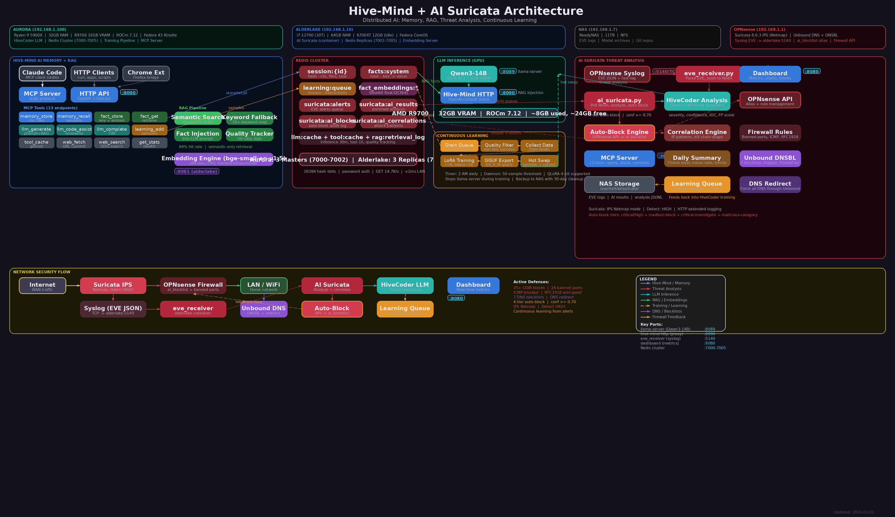

# Hive-Mind

> **Distributed AI Memory System with Semantic RAG, Continuous Learning, and Network Threat Defense**

[](VERSION)
[](https://redis.io/)
[](https://www.python.org/)
[](https://rocm.docs.amd.com/)
[](LICENSE)

A self-improving AI backend that persists context across sessions, enriches LLM prompts with semantic RAG, and continuously fine-tunes a local model from its own interactions. Powers [Talos AI Suricata](https://github.com/tlee933/talos-ai-suricata) for autonomous network threat defense. Fully local, zero cloud dependencies.



---

## What It Does

- **Persistent memory** across terminal restarts, shared across machines via Redis cluster
- **Semantic RAG** that automatically injects relevant context into every LLM prompt
- **Continuous learning** pipeline that collects interactions, fine-tunes via QLoRA, exports to GGUF, and hot-swaps the model into production
- **Network threat defense** — powers [Talos AI Suricata](https://github.com/tlee933/talos-ai-suricata) for autonomous IDS alert analysis and firewall blocking
- **Dual access modes** via MCP protocol (Claude Code) and HTTP API (any client)
- **Active retrieval tracking** with hit rate monitoring and gap analysis
- **Multi-node architecture** — GPU inference on aurora, services on alderlake, storage on NAS

---

## Architecture

| Component | Host | Port | Role |
|-----------|------|------|------|
| **Redis Cluster** | aurora | 7000-7002 | 3 masters, sessions, facts, caches, Suricata alert streams |
| **Redis Replicas** | alderlake | 7003-7005 | 3 replicas for read scaling |
| **HiveCoder (Qwen3-14B)** | aurora | 8089/8090 | LLM inference (llama-server + Hive-Mind HTTP proxy) |
| **Embedding Service** | alderlake | 8081 | bge-small-en-v1.5 for semantic RAG (CPU) |
| **HTTP API** | aurora | 8090 | OpenAI-compatible proxy with RAG injection |
| **MCP Server** | aurora | stdio | Claude Code integration, 13 tools |
| **Learning Daemon** | aurora | - | 5-min interval, drains queue, triggers QLoRA training |
| **Talos AI Suricata** | alderlake | 5140/8080 | Threat analysis container (eve_receiver, ai_suricata, dashboard) |

### Data Flow

```
User Query
  -> MCP Server or HTTP API
    -> Semantic RAG (embed query, cosine sim against facts)
      -> Inject matching facts into system prompt
        -> HiveCoder / Qwen3-14B (:8090)
          -> Response returned
            -> Interaction logged to learning queue

Learning Queue (Redis Stream)
  -> Continuous Learning Daemon (every 5 min)
    -> Quality filter
      -> QLoRA fine-tune -> GGUF export -> Hot swap HiveCoder

Suricata Alerts (via Talos AI Suricata)
  -> OPNsense syslog -> eve_receiver (alderlake:5140)
    -> Redis -> ai_suricata daemon
      -> HiveCoder analysis -> 4-tier auto-block -> OPNsense API
```

### MCP Tools

| Category | Tools |
|----------|-------|
| **Memory** | `memory_store`, `memory_recall`, `memory_list_sessions` |
| **Facts / RAG** | `fact_store`, `fact_get`, `fact_delete`, `fact_suggestions` |
| **LLM** | `llm_generate`, `llm_code_assist`, `llm_complete` |
| **Web** | `web_fetch`, `web_search` |
| **Bridge** | `conversation_log`, `conversation_recent` |
| **System** | `tool_cache_get`, `tool_cache_set`, `learning_queue_add`, `get_stats` |

---

## Performance

| Component | Metric | Value |
|-----------|--------|-------|
| HiveCoder (Qwen3-14B) | Generation speed | ~54 tok/s |
| HiveCoder (Qwen3-14B) | Prompt processing | ~241 tok/s |
| Redis Cluster | Pipeline throughput | 59,763 ops/s |
| Redis Cluster | Latency | < 1ms |
| RAG | Hit rate | 87.5% (31 facts, semantic) |
| Training | Full cycle (QLoRA) | ~4 min (LoRA + GGUF export) |
| VRAM | Inference | ~13 GB / 32 GB |

---

## Quick Start

### Prerequisites

- Docker or Podman (for Redis cluster)
- Python 3.12+ (tested on 3.14)
- AMD GPU with 16GB+ VRAM and ROCm 6.x+ (tested on R9700 32GB, ROCm 7.12)
- [llama.cpp](https://github.com/ggml-org/llama.cpp) (`llama-server` binary)

### Install

```bash
git clone https://github.com/tlee933/hive-mind.git
cd hive-mind

# Deploy Redis Cluster (6 nodes + Docker)
./scripts/deploy-redis-cluster.sh

# Python environment
python3 -m venv .venv
source .venv/bin/activate
pip install -r requirements.txt

# Configure
cp config.example.yaml config.yaml
# Edit config.yaml with your Redis password and model paths
```

### Start Services

```bash
# Redis (should already be running via Docker/Podman)
docker ps | grep redis

# HiveCoder (Qwen3-14B)
./scripts/start-hivecoder.sh

# HTTP API
source .venv/bin/activate
CONFIG_PATH=../config.yaml python mcp-server/http_server.py
```

### Claude Code Integration

Add to `.mcp.json` or `~/.config/claude-code/mcp_config.json`:

```json
{
  "mcpServers": {
    "hive-mind": {
      "command": "python",
      "args": ["mcp-server/server.py"],
      "env": {
        "CONFIG_PATH": "/path/to/hive-mind/config.yaml"
      }
    }
  }
}
```

### HTTP API

```bash
# Health check
curl localhost:8090/health

# Chat with RAG injection
curl localhost:8090/v1/chat/completions \
  -H "Content-Type: application/json" \
  -d '{"messages": [{"role": "user", "content": "explain btrfs snapshots"}]}'

# Interactive docs
open http://localhost:8090/docs
```

---

## Continuous Learning Pipeline

The system improves itself over time — interactions become training data for HiveCoder:

1. **Collect** — Every LLM interaction is logged to a Redis stream
2. **Filter** — Quality filter removes low-quality samples
3. **Train** — QLoRA fine-tuning (4-bit NF4, r=16, alpha=32) triggers after 50+ samples
4. **Export** — Trained model exported to GGUF (Q5_K_M)
5. **Deploy** — Symlink hot-swap + llama-server restart, zero downtime

Two training paths:
- **Automated** — systemd timer at 2 AM daily (`hive-mind-training.timer`)
- **Continuous** — daemon monitors learning queue, trains when threshold reached (`hivecoder-learning.service`)

Both use QLoRA (bitsandbytes 4-bit, built from source for ROCm/gfx1201) and stop the LLM server during training to free VRAM.

```bash
# Check learning status
python learning-pipeline/scripts/continuous_learning.py --status

# Force immediate training
python learning-pipeline/scripts/continuous_learning.py --train-now
```

---

## Semantic RAG

Every LLM call is enriched with relevant facts from the knowledge base:

1. **Embed** the user query using bge-small-en-v1.5 (384-dim, runs on CPU via alderlake embedding service)
2. **Search** against pre-computed fact embeddings via cosine similarity
3. **Filter** by threshold (>= 0.45 good, >= 0.6 strong match)
4. **Inject** matching facts into the system prompt before sending to llama-server
5. **Track** retrieval quality (hit rate, missed queries, weak matches)

---

## Hardware

| Node | Role | Specs |
|------|------|-------|
| **aurora** | GPU inference + training, Redis primary | AMD Ryzen 9, R9700 32GB VRAM, ROCm 7.12, 32GB RAM |
| **alderlake** | Talos AI Suricata, Redis replicas, embeddings | i7-12700 (20T), 64GB RAM, Fedora CoreOS |
| **NAS** | Persistent storage (EVE logs, models, backups) | Synology, NFS, 11TB |
| **OPNsense** | Firewall, Suricata IPS, DNSBL | 192.168.1.1 |

---

## Project Structure

```
hive-mind/
  mcp-server/
    server.py              # MCP server (stdio, 13 tools)
    http_server.py         # HTTP API (:8090) with RAG injection
  learning-pipeline/
    scripts/
      continuous_learning.py   # Training daemon (QLoRA, GPU orchestration)
      train_lora.py            # LoRA/QLoRA fine-tuning
      automated_training.sh    # Daily 2 AM training (systemd timer)
      export_model.py          # GGUF export
    models/                    # Model registry + exports
  scripts/
    deploy-redis-cluster.sh    # Redis cluster setup
    start-hivecoder.sh         # HiveCoder launcher
    backup-to-nas.sh           # Daily model backup with rotation
  config.yaml                  # Redis, inference, embedding config
  diagram_hivemind.py          # Architecture diagram generator (Pillow)
  hivemind_architecture.png    # Architecture diagram
```

---

## How It Compares

| Feature | Hive-Mind | Mem0 | LangMem | Qdrant MCP |
|---------|:---------:|:----:|:-------:|:----------:|
| Persistent memory | Yes | Yes | Yes | Yes |
| Semantic RAG | Yes | Yes | Yes | Yes |
| Local LLM inference | Yes | No | No | No |
| Continuous fine-tuning (QLoRA) | **Yes** | No | No | No |
| Self-improving model | **Yes** | No | No | No |
| Network threat defense | **Yes** | No | No | No |
| Multi-node deployment | **Yes** | No | No | No |
| Retrieval quality tracking | **Yes** | No | No | No |
| MCP protocol | Yes | Yes | No | Yes |
| Fully local / zero cloud | **Yes** | No | No | Partial |

---

## Documentation

| Document | Description |
|----------|-------------|
| [JOURNEY.md](JOURNEY.md) | Full project history, build log |
| [QUICKSTART.md](QUICKSTART.md) | Get running in 2 minutes |
| [MCP_SERVER_READY.md](MCP_SERVER_READY.md) | Operational status, all tools, config |
| [docs/ARCHITECTURE.md](docs/ARCHITECTURE.md) | Deep dive into system design |
| [learning-pipeline/README.md](learning-pipeline/README.md) | Training pipeline docs |

---

## License

MIT

---

<div align="center">

Built on Fedora Atomic (Kinoite 43) with ROCm 7.12 and PyTorch 2.10

[Back to Top](#hive-mind)

</div>
